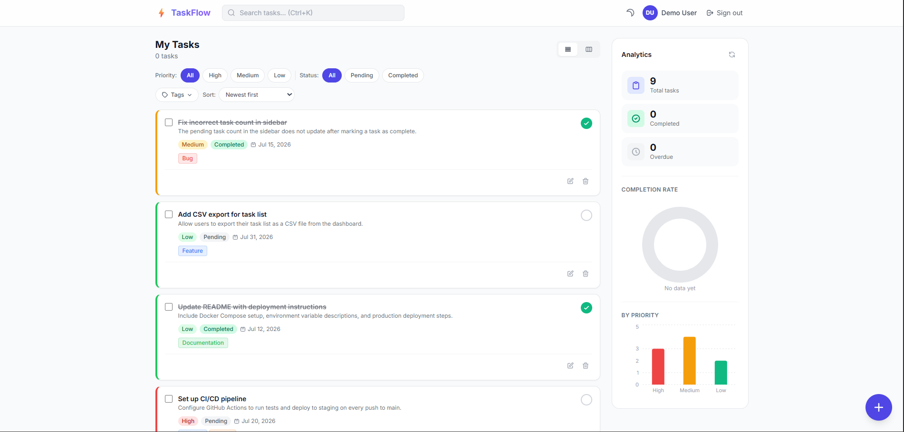
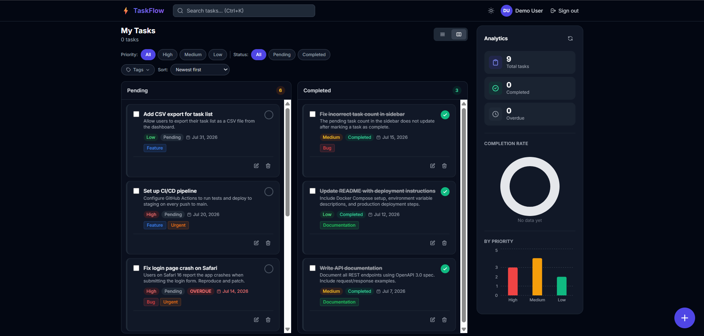
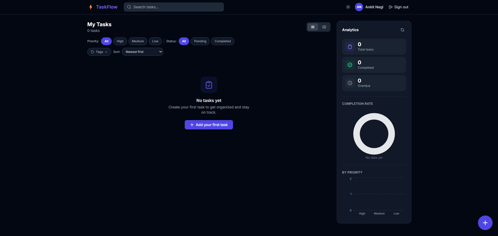
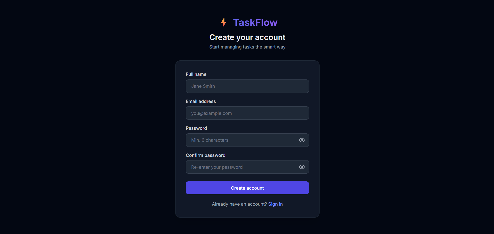
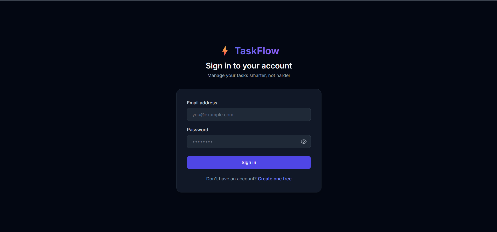

# TaskFlow


A full-stack task management web app built for the Aetheris AI Full Stack Developer assessment.

Users can register, log in, and manage their own tasks: create, edit, delete, mark complete, search, filter, and organize them by priority and tags. The frontend is React, the API is Express + PostgreSQL via Prisma, and the whole thing is containerized with Docker.

## Table of Contents

- [Live Demo](#live-demo)
- [Tech Stack](#tech-stack)
- [Features](#features)
- [Screenshots](#screenshots)
- [Running Locally](#running-locally)
- [Demo Credentials](#demo-credentials)
- [API Reference](#api-reference)
- [Database Schema](#database-schema)
- [Project Structure](#project-structure)
- [Notes and Known Limitations](#notes-and-known-limitations)

## Live Demo

- Frontend: [https://task-flow-lilac-zeta.vercel.app](https://task-flow-lilac-zeta.vercel.app)
- Backend API: [https://task-flow-server-usas.onrender.com/api/health](https://task-flow-server-usas.onrender.com/api/health)

Frontend is deployed on Vercel, backend and PostgreSQL on Render. Since the backend is on Render's free tier, the API may take up to a minute to wake up on the first request after a period of inactivity (cold start) - subsequent requests are fast.

Demo credentials work on the live deployment too, see [below](#demo-credentials).

## Tech Stack

| Layer | Technology |
|---|---|
| Frontend | React 18 (Vite), Tailwind CSS, Zustand, React Router, Axios |
| Backend | Node.js, Express, Prisma ORM |
| Database | PostgreSQL 16 |
| Auth | JWT in httpOnly cookies, bcrypt password hashing |
| Charts | Recharts |
| Drag and drop | dnd-kit |
| Infrastructure | Docker, Docker Compose, Nginx (serves the production frontend build) |

## Features

**Core**
- Register, log in, log out with JWT-based auth
- Create, edit, delete tasks
- Mark tasks pending or completed
- Task fields: title, description, due date, priority, status
- Search, filter by priority/status, sort by due date or priority
- Paginated task list

**Extra**
- Tags on tasks, filterable
- Analytics panel: completion rate and breakdown by priority
- Kanban board view (drag and drop) alongside the list view
- Command palette (Ctrl/Cmd+K) for quick actions
- Dark mode
- Bulk actions: multi-select complete or delete
- Overdue badges computed automatically from due date
- Rate limiting on login to slow brute-force attempts

## Screenshots

### Dashboard


### Kanban Board


### Dark Mode


### Register


### Login

## Running Locally

### With Docker (recommended)

```bash
cp server/.env.example server/.env
# edit server/.env and set a real JWT_SECRET at minimum

docker-compose up --build
```

Frontend: [http://localhost](http://localhost)
API: [http://localhost:5000](http://localhost:5000)

`docker-compose up` brings up Postgres, applies Prisma migrations, seeds demo data, and starts both the API and the Nginx-served frontend automatically.

### Without Docker

Requires Node.js 20+ and a running PostgreSQL instance.

```bash
# Backend
cd server
npm install
cp .env.example .env    # set DATABASE_URL and JWT_SECRET
npx prisma migrate dev --name init
node prisma/seed.js
npm run dev              # http://localhost:5000

# Frontend, in a separate terminal
cd client
npm install
npm run dev               # http://localhost:5173
```

## Demo Credentials

| Email | Password |
|---|---|
| demo@taskflow.com | demo123 |
| user2@taskflow.com | user123 |

## API Reference

All successful responses share the shape `{ success, message, data }`. Errors follow `{ success: false, message, errors? }`.

### Auth

| Method | Endpoint | Auth required | Description |
|---|---|---|---|
| POST | /api/auth/register | No | Create an account |
| POST | /api/auth/login | No | Log in, sets an httpOnly JWT cookie |
| POST | /api/auth/logout | No | Clear the auth cookie |
| GET | /api/auth/me | Yes | Get the current user's profile |

### Tasks

| Method | Endpoint | Auth required | Description |
|---|---|---|---|
| GET | /api/tasks | Yes | List tasks, supports filtering, search, sort, pagination |
| POST | /api/tasks | Yes | Create a task |
| PUT | /api/tasks/:id | Yes | Update a task |
| DELETE | /api/tasks/:id | Yes | Delete a task |
| PATCH | /api/tasks/:id/status | Yes | Toggle a task between pending and completed |
| GET | /api/tasks/stats | Yes | Aggregate counts and completion rate |
| POST | /api/tasks/bulk | Yes | Bulk complete or delete tasks |

**GET /api/tasks query parameters**

| Param | Type | Notes |
|---|---|---|
| status | string | `Pending` or `Completed` |
| priority | string | `High`, `Medium`, or `Low` |
| search | string | Matches title and description, case-insensitive |
| tagIds | string | Comma-separated tag IDs |
| page | number | Default 1 |
| limit | number | Default 10, max 100 |
| sort | string | `dueDate_asc`, `dueDate_desc`, `priority_asc`, `priority_desc`, `createdAt_desc` |

### Tags

| Method | Endpoint | Auth required | Description |
|---|---|---|---|
| GET | /api/tags | Yes | List tags |
| POST | /api/tags | Yes | Create a tag |
| DELETE | /api/tags/:id | Yes | Delete a tag |

## Database Schema

Four tables: `users`, `tasks`, `tags`, and `task_tags` (a join table for the many-to-many relationship between tasks and tags).

```
users
  id          uuid, primary key
  name        varchar
  email       varchar, unique
  password    varchar (bcrypt hash)
  createdAt   timestamp

tasks
  id           uuid, primary key
  userId       uuid, references users.id, cascade delete
  title        varchar
  description  text, nullable
  dueDate      timestamp, nullable
  priority     enum: High, Medium, Low (default Medium)
  status       enum: Pending, Completed (default Pending)
  createdAt    timestamp
  updatedAt    timestamp

tags
  id     uuid, primary key
  name   varchar
  color  varchar hex code, default #6366f1

task_tags
  taskId  uuid, references tasks.id, cascade delete
  tagId   uuid, references tags.id, cascade delete
  primary key (taskId, tagId)
```

Migration files live in `server/prisma/migrations`. To apply them against a fresh database:

```bash
npx prisma migrate deploy
```

## Project Structure

```
taskflow/
├── server/
│   ├── prisma/
│   │   ├── schema.prisma
│   │   ├── migrations/
│   │   └── seed.js
│   ├── src/
│   │   ├── controllers/
│   │   ├── middleware/
│   │   └── routes/
│   ├── Dockerfile
│   └── .env.example
├── client/
│   ├── src/
│   │   ├── api/
│   │   ├── store/
│   │   ├── hooks/
│   │   ├── pages/
│   │   └── components/
│   ├── Dockerfile
│   └── nginx.conf
└── docker-compose.yml
```

## Notes and Known Limitations

- The production JS bundle is a single chunk around 940KB. Fine at this scale, would split by route in a larger app.
- Login is rate limited; other endpoints are not.
- Auth uses a single long-lived JWT (7 days) in an httpOnly cookie. There is no refresh-token rotation.
- Task filtering by tag currently requires the task to have every tag listed, not just one of them.

---

Built by Ankit Negi.